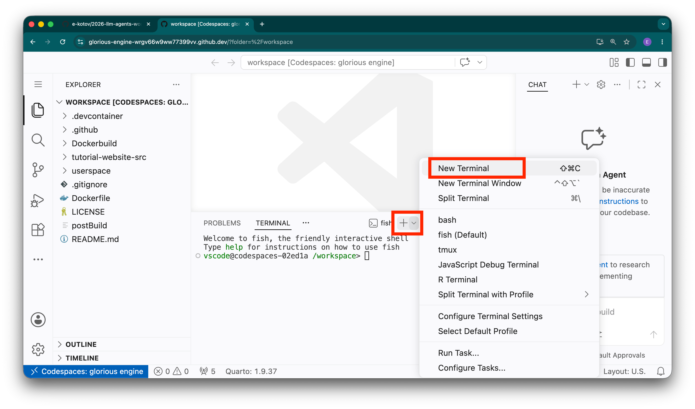

Use OpenCode for the workshop. Its terminal shows what the agent reads, edits, runs, and asks you to approve.

## Start OpenCode

From the repository root, enter the lab folder and launch OpenCode:

```bash
cd exercises/lab-01-first-contact
opencode
```

{#fig-vscode-new-terminal fig-alt="VS Code with its Terminal menu open and the New Terminal command highlighted."}

First ask which instruction files and skills OpenCode loaded, without letting it edit anything. Check its answer against the files on disk.

After you have seen ordinary approval prompts, the labs may ask you to use `opencode --auto` in this disposable Codespace. It auto-approves permissions that are not explicitly denied. For a non-interactive prompt, use `opencode run --auto "<quoted prompt>"`. Check the OpenCode documentation if the interface or commands differ.

## Stop or leave a session

If OpenCode starts the wrong operation, press `Esc` to interrupt the current response or tool run. Read what changed with `git diff` before continuing; interruption does not undo completed edits or commands. To leave normally, type `/exit` (aliases: `/quit` and `/q`). The default keyboard shortcut is `Ctrl+X`, then `Q`. These controls are documented in the [OpenCode keybind reference](https://opencode.ai/docs/keybinds/) and [TUI command reference](https://opencode.ai/docs/tui/).

## Optional comparisons

- [**Antigravity**](https://antigravity.google/docs/cli/install/) is Google's agent workbench. It has its own project rules and sandbox settings.
- [**Codex**](https://developers.openai.com/codex/) is OpenAI's coding agent. See the Codex guide.
- [**Claude Code**](https://code.claude.com/docs/) is Anthropic's terminal agent. See the Claude Code documentation.

Their instruction precedence, hooks/plugins, skills, permissions, model routes, and automatic modes differ. For example, each agent may treat `AGENTS.md` differently.

## Further reading

- [OpenCode documentation](https://opencode.ai/docs/) — The current reference for the supported workshop harness and its model, tool, and configuration surface.
- [Codex documentation](https://developers.openai.com/codex/) — Compare OpenAI's first-party description instead of assuming that another terminal agent has OpenCode's controls.
- [Claude Code overview](https://code.claude.com/docs/en/overview) — A third first-party comparison that makes the model-versus-harness distinction concrete.

::: {.callout-warning}
Antigravity is not the retired Gemini CLI. Do not connect real research data just to compare agents.
:::
