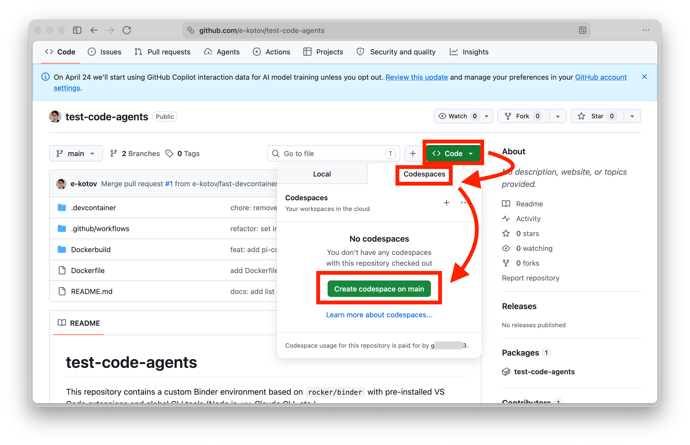
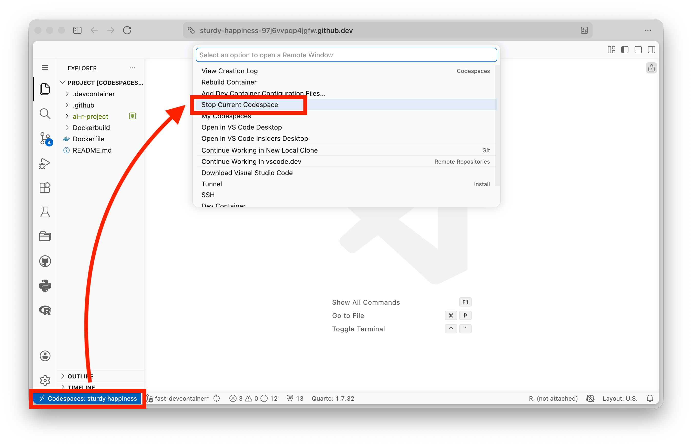

Start your GitHub Codespace before the first lab. Setup can take several minutes.

## Launch

1. Open the [workshop repository](https://github.com/e-kotov/2026-09-agentic-workshop).
2. Select **Code → Codespaces → Create codespace**. Keep the default branch and machine unless the facilitator says otherwise.
3. Wait for VS Code to finish setting up the project. Open a terminal and run `pwd` and `ls`.



::: {.callout-note}
## Check the setup

You should see the repository in Explorer, a working terminal, R and Python, and the `exercises/` folders. Wait for setup to finish before starting an agent.
:::

## Pause and recover

Resume a paused Codespace from [your Codespaces list](https://github.com/codespaces). If the build fails, save the visible error and ask the facilitator. Do not add credentials to make it work.

Stop the Codespace when you finish. Delete it when you no longer need its files. Check [GitHub's billing documentation](https://docs.github.com/en/billing/concepts/product-billing/github-codespaces) for current quotas and prices.

::: {.callout-warning}
A Codespace separates workshop files from your laptop. It does not keep agent prompts inside the Codespace. Use only fake or source-free data with provider-facing agents.
:::
