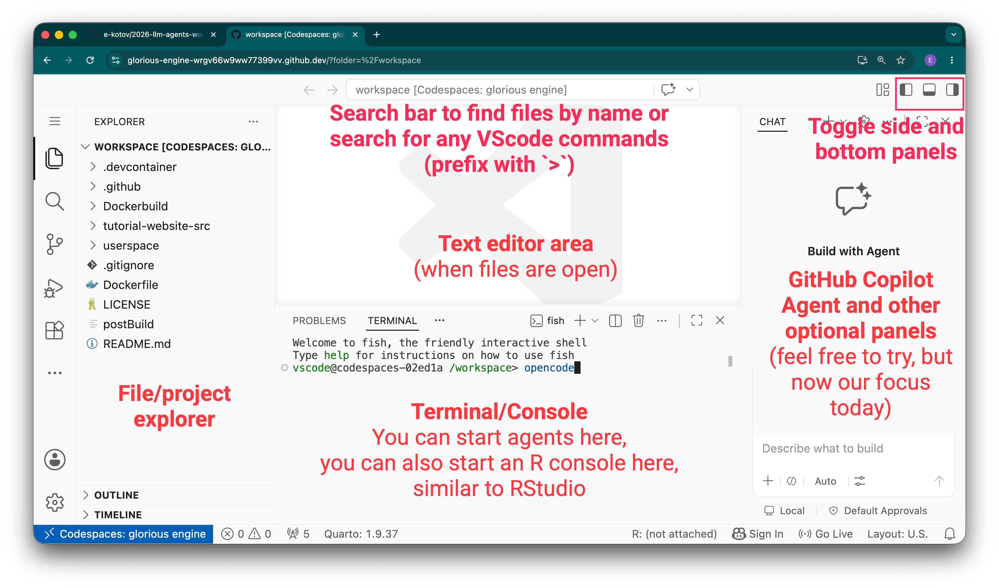
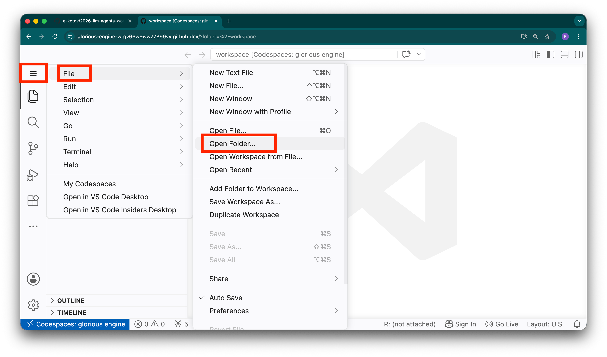

Use VS Code to read the lab README, open a terminal in the right folder, and inspect the agent's changes.



## Find the essentials

1. In **Explorer**, open `exercises/lab-01-first-contact/README.md` and keep it visible.
2. Use **Open Editors** to return to changed files.
3. Open **Terminal → New Terminal**. Run `pwd` before any command that changes files.
4. Use Source Control to inspect changed files and diffs. Read a large diff before accepting it.

To work inside one folder, right-click it and choose **Open in Integrated Terminal**. You can also use **File → Open Folder** to open one lab as the VS Code workspace.

The **workspace** is the folder shown at the top of Explorer. The terminal's **working directory** is the folder printed by `pwd`. They can differ: opening a lab as the workspace changes what VS Code shows, while `cd` changes only that terminal. Start an agent from the lab directory because its launch directory helps determine which project files and instructions it discovers. An agent started at the repository root can see a much wider tree than one started inside a lab.



::: {.callout-note}
Watch how to [open a project](../media/videos/vscode-open-folder-as-project-new-window.mp4), [open a terminal](../media/videos/vscode-open-folder-in-terminal.mp4), or [browse files](../media/videos/vscode-file-explorer.mp4). If a recording looks different, follow the menus in your Codespace.
:::

::: {.callout-tip}
### Tiny orientation experiment (3 minutes)

Run `pwd` and `find . -maxdepth 2 -type f | sort | head`. Ask the agent what the output tells it, then compare its answer with Explorer. Do not allow edits yet.
:::

Useful commands: `pwd` (where am I?), `ls` (what is here?), `cd folder` (move into a folder), and `git diff` (what changed?). Check the target before running any destructive command suggested by an agent.

## If you get lost

From any directory inside this repository, return to its root with:

```bash
cd "$(git rev-parse --show-toplevel)"
pwd
```

You should now see a path ending in `/2026-09-agentic-workshop`. Then enter the lab named in its README. If `git rev-parse` says that you are not in a Git repository, find the repository in Explorer, right-click its top folder, and choose **Open in Integrated Terminal**; then run the command again. To reset the visible VS Code workspace, use **File → Open Folder** and select that same repository folder.

## Further reading

- [Visual Studio Code user interface](https://code.visualstudio.com/docs/getstarted/userinterface) — A durable reference for Explorer, editors, panels, the terminal, and the status bar when the workshop recording looks different.
